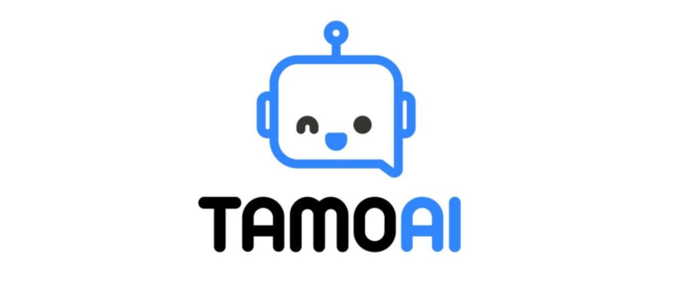
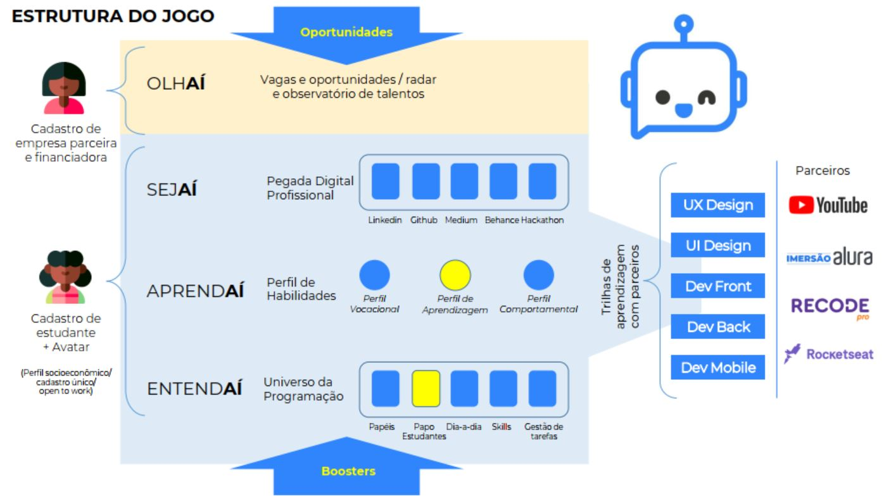

<i>Sua jornada, do seu jeito!</i>

### 💡 Desafio & Cenário

O baixo acesso ao universo das profissões de Teconologia nas escolas e regiões periféricas

🤔 *Principais dúvidas dos jovens*
 - É possível trabalhar com Tecnologia?
 - A formação é cara?
 - Precisa ter um computador bom?
 - Será que existe possibilidade de ser contratado?
  
### 🚀 Oportunidade
Falta profissionais de tecnologia no mercado brasileiro
- Segundo a Brasscom, essas vagas correspondiam a 160 mil posições não preenchidas em 2019, e serão 420 mil até 2024
- Até 2030 se prevê um déficit de 1 milhão de profissionais de tecnologia no Brasil

### 🏁 Objetivos
Trabalhar com tecnologia é uma oportunidade de transformação da realidade da periferia! Os jovens podem abrir suas mentes para reconhecer potenciais e expandir a visão para apresentar possibilidades.
- Abrir novos horizontes para jovens das periferias
- Oferece caminhos personalizados de formação para entrar no mercado da tecnologia

## 🗺 Jornada & Radar

## 💪 Boosters & Atrativos
A **gamificação** e a **inteligência artificial** também conseguirãoidentificar oportunidades e necessidades dos estudantes para catalisar o seu desenvolvimento.
- Plataforma disponível para mobile, facilitando o acesso
- Meios de aprendizado de acordo com perfil individual
- Acesso a máquinas para viabilizar estudos
- Cursos disponíveis off-line para quem não tem internet
- Vagas de estágio em empresas parceiras
- Bolsas de estudos em universidades

### 🤝 Ações físicas, além do digital
Assim que for possível, vamos realizar ações físicas nas periferias para a solução ser ainda mais democrática e oferecer maior acesso e capilaridade, através de parcerias:
- Universidades e Escolas Públicas
- Centros comunitários e Organizações da Sociedade Civil

## ⚙ Tecnologias
- [React Native](https://reactnative.dev/)
- [NodeJS](https://nodejs.org/en/)
  

 ## 💪 Time
  - Daniel Leite (Designer)  [LinkedIn](https://www.linkedin.com/in/daniel-leite-aa17b843/) . [Behance](https://www.behance.net/danielrodrigo)
  - Léo Moraes (Business) [LinkedIn](https://www.linkedin.com/in/leohmoraes/)
  - Everton Ferreira (Dev) [LinkedIn](https://www.linkedin.com/in/evertonferreira96/)
  - Sávio Sucar (Marketing) [Linkedin](https://www.linkedin.com/in/diagosucar/)
  - Vinicius Passos (Dev) [LinkedIn](https://www.linkedin.com/in/vtpa/) . [GitHub](https://github.com/vtpa)
